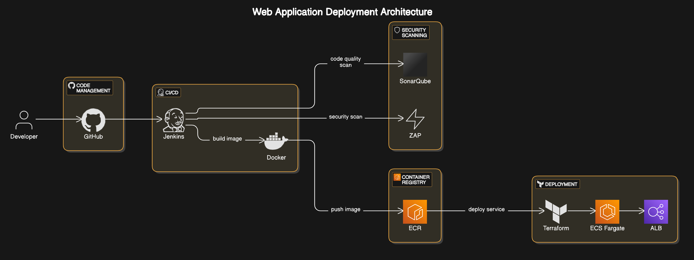

# 🚀 Secure CI/CD Pipeline with Jenkins, Terraform, AWS & OWASP ZAP

[](https://github.com/numesh06/secure-ci-cd-pipeline/actions/workflows/ci-cd.yml)

## 📌 Overview
This project showcases a secure and automated CI/CD pipeline built using modern DevOps tools and cloud infrastructure. It includes:

- **Jenkins**: Automates the CI/CD pipeline
- **Terraform**: Manages and provisions AWS infrastructure as code
- **Docker**: Containerizes the Node.js application
- **AWS ECS (Fargate)**: Hosts the Docker containers
- **AWS ECR**: Stores Docker images
- **SonarQube**: Performs static code analysis
- **OWASP ZAP**: Conducts automated security scans

## 🧱 Architecture Diagram


## 📂 Tech Stack
| Tool          | Purpose                            |
|---------------|-------------------------------------|
| Jenkins       | CI/CD orchestration                |
| Terraform     | IaC for AWS infra                  |
| Docker        | Containerization                   |
| AWS ECS/ECR   | Deploy and host containers         |
| SonarQube     | Static code analysis               |
| OWASP ZAP     | Dynamic security scans             |
| GitHub        | Source code repository             |

## 🛠️ Setup Instructions

### 1. Clone the Repository
```bash
git clone https://github.com/numesh06/secure-ci-cd-pipeline.git
cd secure-ci-cd-pipeline
```

### 2. Configure Terraform
- Update `terraform/variables.tf` with your AWS VPC, subnet, and security group IDs
- Run:
```bash
cd terraform
terraform init
terraform apply -auto-approve
```

### 3. Build and Push Docker Image
```bash
docker build -t my-app .
docker tag my-app:latest <aws_account_id>.dkr.ecr.<region>.amazonaws.com/my-ecr-repo:latest
docker push <aws_account_id>.dkr.ecr.<region>.amazonaws.com/my-ecr-repo:latest
```

### 4. Jenkins Pipeline
- Add `Jenkinsfile` to your Jenkins project
- Add credentials for GitHub and AWS access
- Configure Jenkins global tools (Java, Terraform, Docker, etc.)
- Trigger a build

## 📈 CI/CD Pipeline Flow
1. **Checkout Code** from GitHub
2. **Build Docker Image**
3. **Push to AWS ECR**
4. **Deploy on AWS ECS (Fargate)**
5. **Run SonarQube Analysis**
6. **Run OWASP ZAP Scan**

## 🔍 SonarQube Configuration
- Ensure SonarQube is running on `http://localhost:9000`
- Add `sonar-project.properties` with your project config:
```properties
sonar.projectKey=securing-ci-cd-pipeline
sonar.host.url=http://localhost:9000
sonar.sources=.
sonar.language=js
sonar.sourceEncoding=UTF-8
```

## 🔒 OWASP ZAP Security Scan
- Install OWASP ZAP
- Use `zap-cli` or the desktop app to scan the deployed app
```bash
zap-cli start
zap-cli open-url http://<alb-dns-name>
zap-cli active-scan http://<alb-dns-name>
zap-cli report -o zap_report.html -f html
```

## 🌐 Access the Application
Once deployed, the application is accessible via:
```
http://<alb-dns-name>
```

## 📜 License
[MIT License](LICENSE)

---
Made with ❤️ by [Nandhiniumesh](https://github.com/numesh06)
